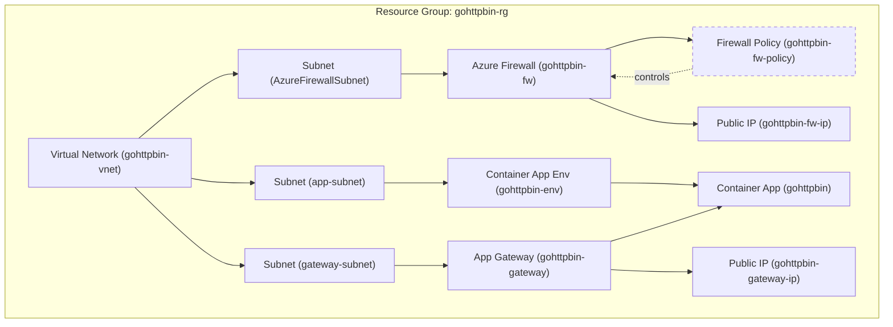

```mermaid
graph TD
    subgraph Resource Group: gohttpbin-rg
        VNET["Virtual Network (gohttpbin-vnet)"]
        SUBNET_APP["Subnet (app-subnet)"]
        SUBNET_GATEWAY["Subnet (gateway-subnet)"]
        FW_SUBNET["Subnet (AzureFirewallSubnet)"]
        FW["Azure Firewall (gohttpbin-fw)"]
        FW_POLICY["Firewall Policy (gohttpbin-fw-policy)"]
        FW_PUBLIC_IP["Public IP (gohttpbin-fw-ip)"]
        CA_ENV["Container App Env (gohttpbin-env)"]
        CA["Container App (gohttpbin)"]
        AGW["App Gateway (gohttpbin-gateway)"]
        AGW_PUBLIC_IP["Public IP (gohttpbin-gateway-ip)"]
    end

    VNET --> SUBNET_APP
    VNET --> SUBNET_GATEWAY
    VNET --> FW_SUBNET

    FW_SUBNET --> FW
    FW --> FW_POLICY
    FW --> FW_PUBLIC_IP

    SUBNET_APP --> CA_ENV
    CA_ENV --> CA

    SUBNET_GATEWAY --> AGW
    AGW --> AGW_PUBLIC_IP
    AGW --> CA

    FW_POLICY -. controls .-> FW

    style FW_POLICY stroke-dasharray: 5 5
```